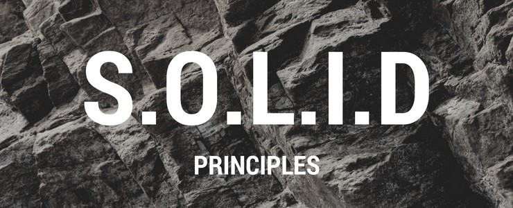

<h1 align="center">
    
</h1>

<h4 align="center">
  🚀 API node.js WITH TYPESCRIPT and concepts of SOLID, was passed through the bootcamp @rocketseat
</h4>

<h1 align="center">
  
  
  
</h1>

## :rocket: Technologies

This project was developed with the following technologies:

- [Typescript](https://www.typescriptlang.org/)
- [Ts-node-dev](https://www.npmjs.com/package/ts-node-dev)
- [Express](https://expressjs.com/pt-br/)
- [Typeorm](https://typeorm.io/#/)
- [Json-web-token](https://www.npmjs.com/package/jsonwebtoken)
- [Date-fns](https://date-fns.org/)
- [Multer](https://github.com/expressjs/multer)
- [Bcryptjs](https://www.npmjs.com/package/bcryptjs)
- [Express-async-errors](https://www.npmjs.com/package/express-async-errors)
- [Docker](https://www.docker.com/)
- [Jest](https://jestjs.io/)

